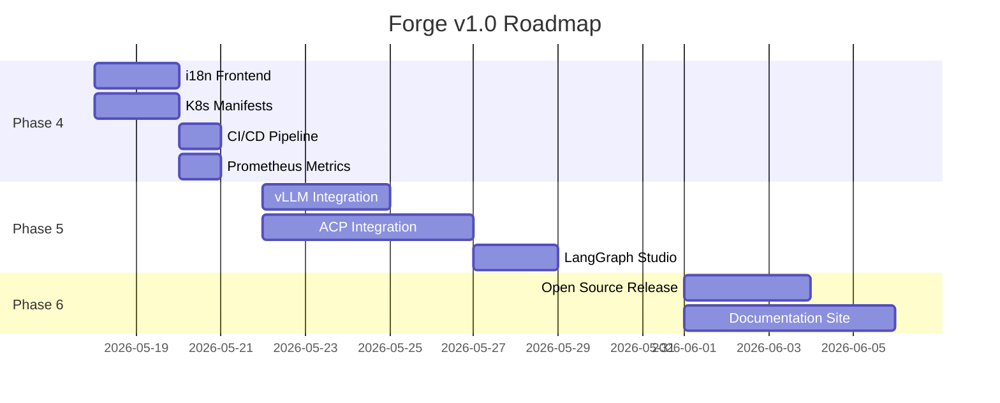

# Forge × DeerFlow — Development Roadmap

## Legend
- ✅ **Done** — Integrated, tested, working
- ◐ **Beta** — Working but needs polish
- 🚧 **In Progress** — Active development
- ⬜ **Planned** — On the radar

## Phase 1: Foundation ✅ (Completed)

| Task | Status | Notes |
|------|--------|-------|
| FastAPI project scaffolding | ✅ | main.py, config, database, alembic |
| SQLAlchemy models (14) | ✅ | User/Org/Team/Session/Task/Approval/Audit/etc |
| JWT auth + RBAC | ✅ | 5 roles, org/team hierarchy |
| REST API routes (12) | ✅ | CRUD for all entities |
| Docker sandbox | ✅ | Isolated execution |
| Rate limiting | ✅ | Middleware |
| Feishu card templates | ✅ | Interactive approval cards |

## Phase 2: HITL & Enterprise Security ✅ (Completed)

| Task | Status | Notes |
|------|--------|-------|
| 18 HITL security rules | ✅ | rm -rf, SQL DROP, sudo, chmod, curl|sh, etc |
| 4 approval strategies | ✅ | SINGLE / MULTI / ESCALATION / CONSENSUS |
| ToolGateway | ✅ | Unified tool entry with audit + HITL |
| Audit logging | ✅ | Pre/post execution logging |
| Async task queue | ✅ | Redis Streams + workers |
| Progress tracking | ✅ | 0-100% + TaskEvent stream |

## Phase 3: DeerFlow Integration ✅ (Completed)

| Task | Status | Notes |
|------|--------|-------|
| Multi-provider models | ✅ | OpenAI/Anthropic/DeepSeek/Google/Ollama |
| 14 middleware chain | ✅ | All with runtime hooks |
| 21 SKILL.md skills | ✅ | All community skills deployed |
| Memory system | ✅ | JSON persistence, keyword retrieval |
| Sub-agent executor | ✅ | Independent LLM agents + background |
| Summarization | ✅ | LLM-based context compression |
| Loop detection | ✅ | Sliding window + hash |
| MCP stdio/SSE | ✅ | Tool discovery/call |
| IM channels (7) | ✅ | Feishu/Slack/Telegram/DingTalk/WeChat/WeCom/Discord |
| Custom agent (SOUL.md) | ✅ | User-created agents |
| MCP OAuth | ✅ | client_credentials + refresh_token |
| Frontend pages (8) | ✅ | All management UIs |
| Integration tests (9) | ✅ | Config/models/middleware/tools/memory |

## Phase 4: Production Hardening 🚧 (Current)

| Task | Status | Priority | Effort |
|------|--------|----------|--------|
| Frontend i18n (EN/CN/JA) | ✅ | 3 languages, all pages i18n-ready |
| More model providers (vLLM, xAI, etc.) | ⬜ | P1 | 1 day |
| Kubernetes deployment manifests | ⬜ | P1 | 2 days |
| Prometheus metrics | ⬜ | P1 | 1 day |
| Session persistence (PostgreSQL) | ⬜ | P1 | 2 days |
| CI/CD pipeline (GitHub Actions) | ⬜ | P1 | 1 day |
| E2E tests (Playwright) | ⬜ | P2 | 3 days |
| API documentation (OpenAPI) | ⬜ | P2 | 1 day |
| Load testing (k6) | ⬜ | P2 | 2 days |

## Phase 5: Advanced Features ⬜ (Planned)

| Task | Status | Priority | Effort |
|------|--------|----------|--------|
| Self-hosted model (vLLM/TGI) integration | ⬜ | P1 | 3 days |
| ACP agent integration (Claude Code/Codex) | ◐ | P1 | 3 days |
| Skill evolution (agent-created skills) | ⬜ | P2 | 3 days |
| Multi-language i18n (JP/FR/RU) | ◐ | P2 | 2 days |
| LangGraph Studio support | ⬜ | P2 | 2 days |
| Agent observability (LangFuse) | ◐ | P2 | 1 day |
| Migration from SQLite option | ⬜ | P3 | 1 day |
| Multi-region deployment | ⬜ | P3 | 5 days | 2 days |
| Plugin marketplace | ⬜ | P3 | 5 days |

## Phase 6: Community & Ecosystem ⬜ (Future)

| Task | Status | Notes |
|------|--------|-------|
| Open source release | ⬜ | Apache 2.0 license |
| Contributor guide | ⬜ | CONTRIBUTING.md |
| Developer documentation site | ⬜ | MDX-based |
| Community skill submissions | ⬜ | PR-based workflow |
| Public demo instance | ⬜ | docker-compose one-click |

## Current Milestone: v1.0 (Production Ready)

Focus: hardening, testing, and deployment

